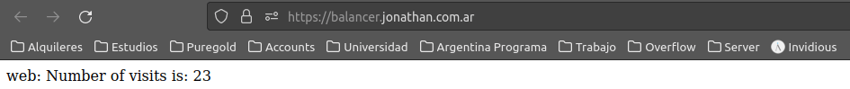
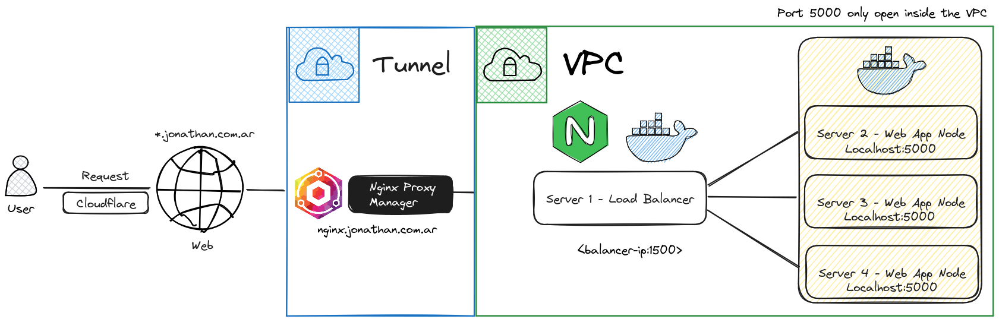

# 🟩 Nginx

Demo example of how to build a load balancer with Nginx

Computers i'm using are from cloud guru





## Requirements 🧰

[Ansible](https://docs.ansible.com/ansible/latest/installation_guide/intro_installation.html)

Configure the hosts in the `hosts` file which is in `ansible/inventory/hosts`

Install sshpass

```bash
sudo apt install sshpass
```

If you have problems with the ssh keys, you can disable the verification with the following command:

```bash
export ANSIBLE_HOST_KEY_CHECKING=False
```

## Usage 🚀

```bash
make run playbook="<playbook>"
```

